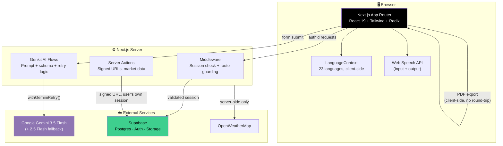
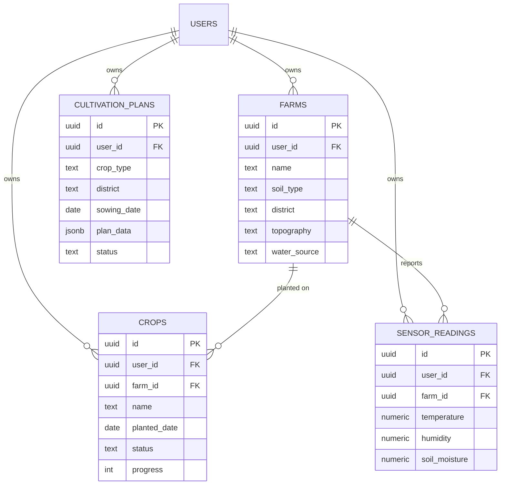

<div align="center">

# 🌾 Vivasayi — A Farmer's Assistant

**AI-powered farm management for Indian farmers.**
Track farms, diagnose crop disease from a photo, get a week-by-week cultivation plan, and ask farming questions in your own language.

[](https://nextjs.org)
[](https://react.dev)
[](https://www.typescriptlang.org)
[](https://supabase.com)
[](https://ai.google.dev)
[](https://vitest.dev)
[](#)

</div>

---

## 📋 Table of Contents

- [What it does](#-what-it-does)
- [Feature tour](#-feature-tour)
- [Architecture](#-architecture)
- [Tech stack](#-tech-stack)
- [Project structure](#-project-structure)
- [Database schema](#-database-schema)
- [Getting started](#-getting-started)
- [Scripts](#-scripts)
- [Honest status report](#-honest-status-report)
- [Roadmap](#-roadmap)

---

## 🚜 What it does

Vivasayi (Tamil/Hindi-rooted word for "farmer") is a web app that puts four AI-backed tools and basic farm record-keeping in front of a farmer, in their own language:

| | |
|---|---|
| 🌱 **Crop recommendation** | Suggests crops based on soil type, district, and season |
| 📸 **Disease detection** | Photo → Gemini Vision diagnosis → treatment plan |
| 📅 **Cultivation planner** | Week-by-week plan from sowing to harvest, exportable as a PDF |
| 💬 **Multilingual chatbot** | Farming Q&A, answers in whatever language it's asked in |
| 🏡 **Farm management** | Track multiple farms — soil type, district, topography, water source |
| ☁️ **Weather** | Current conditions for the farmer's district |

---

## 🧭 Feature tour

*(Note: Add your screenshot images to the `screenshots/` directory at the root of the project to display them here.)*

### Dashboard & Farm Tracking

Standard CRUD over Supabase Postgres — add farms, track crops against them, view sensor readings if you wire up real IoT hardware (the table and UI are ready; there's no hardware integration shipped).

### AI Crop Recommendations

Get AI-generated suggestions based on soil type, district, and season.

### Disease Detection

Upload a photo or use **`capture="environment"`** to open the phone's rear camera directly. The image goes to **Gemini 3.5 Flash** (vision-capable), which identifies the plant, examines symptoms (lesions, blight, discoloration, pests), and returns a structured diagnosis — disease name, confidence score, visual evidence, and a treatment recommendation — in the farmer's selected language.

### Personalized Cultivation Plan

Pick a crop, district, and sowing date. Gemini generates a week-by-week plan tracked against today's date, with a progress bar showing where the farmer currently stands in the crop cycle. The rendered plan can be exported client-side as a paginated PDF (`jsPDF` + `html2canvas` — no server round-trip).

### Multilingual Chatbot

Grounded in a local farming knowledge base (soil, fertilizer, crop basics) bundled with the app, so it can answer common questions even without external lookups. Responds in the same language it's asked in, using native script — not transliteration.

### Market Prices & Weather

Current weather for the farmer's primary district and a reference table of recent mandi (market) prices.

### Voice In, Voice Out
Two browser-native Web Speech API integrations, no third-party service:
- 🎤 **Voice input** (`SpeechRecognition`) — speak a question instead of typing it
- 🔊 **Speak button** (`SpeechSynthesis`) — has any AI response read aloud, auto-matched to the farmer's selected language with graceful fallback if the device has no voice installed for that language

---

## 🏗️ Architecture



**Auth flow:** Supabase session cookies are checked in `middleware.ts` on every request. Unauthenticated users hitting a protected route are redirected to `/login` with a `redirectedFrom` param; authenticated users hitting `/login` or `/register` are bounced to `/dashboard`.

**AI call resilience:** every Gemini call goes through `withGeminiRetry()` — exponential backoff with jitter for transient errors (429/500/503/504), immediate fallback to `gemini-2.5-flash` for daily quota exhaustion (which won't clear on its own, so backoff would just waste time), and the *original* error is what's surfaced if both the retry and the fallback fail.

---

## 🛠️ Tech stack

<table>
<tr>
<td valign="top" width="50%">

**Frontend**
- Next.js 15.5 (App Router)
- React 19 · TypeScript 5.5
- Tailwind CSS · Radix UI primitives
- shadcn-style component layer
- React Hook Form + Zod validation
- Recharts (dashboard charts)

</td>
<td valign="top" width="50%">

**Backend & AI**
- Supabase — Postgres, Auth, Storage
- `@supabase/ssr` for server-side session handling
- Google Gemini 3.5 Flash via **Genkit**
- `jsPDF` + `html2canvas` (client-side PDF export)
- OpenWeatherMap (server-side only)

</td>
</tr>
</table>

**Testing:** Vitest + React Testing Library + jsdom, configured and passing as of the latest commit.

---

## 📁 Project structure

```
src/
├── ai/
│   ├── flows/              # Genkit flows: disease detection, crop
│   │                        # recommendations, chatbot, cultivation plan
│   ├── genkit.ts            # Gemini 3.5 Flash client config
│   └── with-retry.ts        # Backoff + quota-aware fallback wrapper
├── app/                     # Next.js App Router pages
│   ├── dashboard/  farms/  disease-detection/
│   ├── crop-recommendation/  personalized-space/
│   └── login/  register/  profile/  auth/callback/
├── actions/                 # Server actions (signed storage URLs, market data)
├── components/
│   ├── features/             # Forms, cards, chatbot, voice I/O, PDF export
│   ├── layout/                # AppShell, Logo, language switcher
│   └── ui/                     # shadcn-style primitives
├── context/
│   ├── AuthContext.tsx        # Auth state, app-wide
│   └── LanguageContext.tsx    # 23-language client-side i18n
├── lib/
│   ├── supabase-client.ts     # Single shared browser Supabase client
│   ├── languages.ts            # Language metadata (single source of truth)
│   └── storage.ts               # Private-bucket upload helper
├── messages/                 # en, hi, ta, + 20 schema-synced language files
├── middleware.ts              # Route guarding, session refresh
└── services/                  # Weather + market price reference data

supabase/
└── migrations.sql            # Schema + row-level security policies
```

---

## 🗄️ Database schema

All four tables live in `public` schema with **row-level security enabled and scoped to `auth.uid()`** — a farmer can only ever see their own rows.



Plus a **private** storage bucket (`vivasayi-storage`) for soil reports, with policies that folder-scope access to `{user_id}/...` — one farmer can never list or sign a URL for another farmer's files. Files are served via short-lived (10-minute) signed URLs generated server-side using the requester's own session, not a service-role bypass.

---

## 🚀 Getting started

### Prerequisites
- Node.js 20+
- A [Supabase](https://supabase.com) project
- A [Google AI Studio](https://aistudio.google.com/app/apikey) API key
- An [OpenWeatherMap](https://openweathermap.org/api) API key

### Setup

```bash
# 1. Install dependencies
npm install

# 2. Copy and fill in environment variables
cp .env.example .env.local
```

```env
GOOGLE_GENAI_API_KEY=
WEATHER_API_KEY=
NEXT_PUBLIC_SUPABASE_URL=
NEXT_PUBLIC_SUPABASE_ANON_KEY=
```

```bash
# 3. Set up the database — run supabase/migrations.sql in the
#    Supabase SQL Editor, or:
supabase db push

# 4. Run locally
npm run dev
```

> **One manual step the SQL can't do:** in the Supabase dashboard, go to **Storage → vivasayi-storage → Settings** and confirm "Public bucket" is **off**.

**Optional — Google OAuth:** in Supabase, go to **Authentication → Providers → Google**, add your credentials, and set the redirect URL to `{your-app-url}/auth/callback`.

---

## 📜 Scripts

| Command | What it does |
|---|---|
| `npm run dev` | Start the dev server |
| `npm run build` | Production build |
| `npm run start` | Run the production build |
| `npm run lint` | ESLint |
| `npm run typecheck` | `tsc --noEmit` |
| `npm run test` | Run the Vitest suite |
| `npm run genkit:dev` | Launch the Genkit dev UI to inspect/test AI flows directly |

---

## ✅ Honest status report

This section exists so this README doesn't oversell the project. Verified directly against the codebase, not aspirational.

| Area | Status |
|---|---|
| 🔐 Critical security CVEs (Next.js RCE, jsPDF injection chain) | **Patched.** `npm audit` reports 0 critical as of the latest commit. |
| 🧪 Automated tests | **Present but thin.** Vitest is configured and a small suite passes (a utility-function test and one component render test). Core business logic — AI flows, RLS-dependent queries, auth — is not yet covered. |
| 🌐 UI translation (23 languages) | **Plumbing complete, content partial.** The language switcher, persistence, and fallback chain all work. Hindi and Tamil have real translated UI strings. The other 20 language files are schema-valid but currently hold English placeholder text. |
| 💬 Chatbot multilingual replies | **Fully real**, independent of the UI string files above — Gemini generates the response directly in whatever language is requested. |
| 💰 Crop price data | **Not live.** `getLatestCropPrices` returns a static reference table; the AI-estimate path asks Gemini for a plausible estimate, not a real-time mandi quote. |
| 📊 Historical crop yield data | **Mocked** — a small hardcoded sample, not a real agricultural dataset. |
| 🖼️ PWA icons | Present at 192×192 and 512×512, functional but placeholder artwork. |

---

## 🗺️ Roadmap

- [ ] Translate the remaining 20 language files (Hindi and Tamil are done; the rest are schema-ready)
- [ ] Expand test coverage to AI flows and Supabase-dependent logic
- [ ] Wire up a real market-price data source (data.gov.in or a commercial mandi API)
- [ ] Replace placeholder yield dataset with real agricultural data
- [ ] Replace placeholder PWA icons with branded artwork

---

<div align="center">

Built for Indian farmers, in their own languages, by **[Madhavan-dev18](https://github.com/Madhavan-dev18)**

</div
